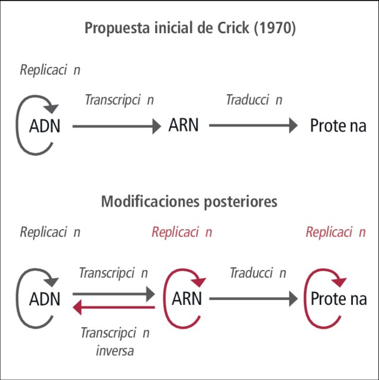
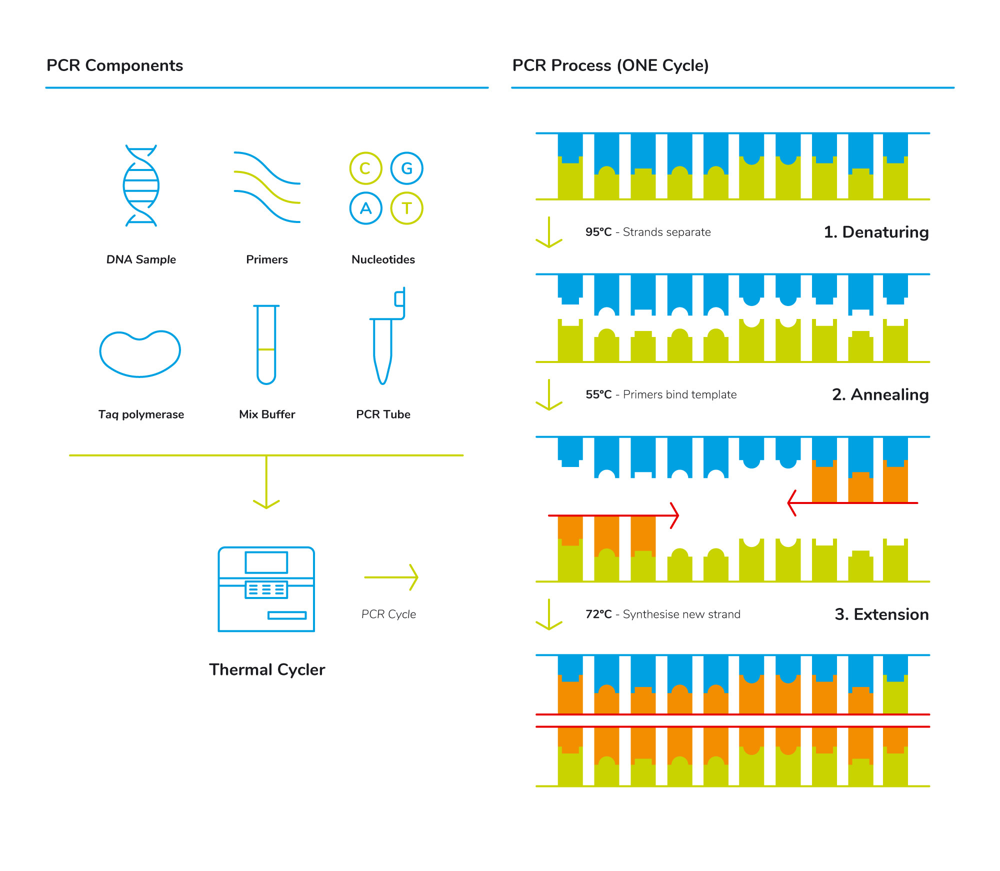
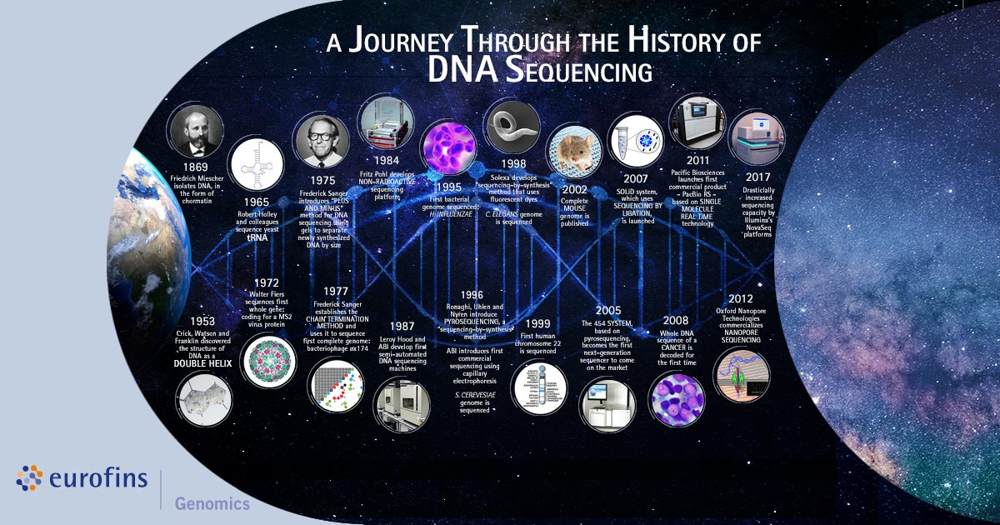

# 1.1. Origen y Definición de la Bioinformática

## 📌 Definición General
La **bioinformática** es una disciplina interdisciplinaria que combina **biología, informática, matemáticas y estadística** con el fin de **almacenar, analizar e interpretar datos biológicos**.
Su objetivo central es **transformar datos biológicos en conocimiento útil**, permitiendo descubrir patrones, relaciones y mecanismos que no serían evidentes sin la ayuda de herramientas computacionales.

**Repaso**

Dogma central de DNA ¿quién se acuerda?




¿y de la PCR?...


---

## 📌 Contexto Histórico del Origen de la [secuenciación](https://the-dna-universe.com/2020/11/02/a-journey-through-the-history-of-dna-sequencing/)

### 🔹 Antes de la era genómica (años 60–80)
- En los **años 60 y 70**, los biólogos comenzaron a acumular secuencias de proteínas y ácidos nucleicos.
- Una de las primeras bases de datos fue creada por **Margaret Dayhoff** en 1965, llamada **Atlas of Protein Sequence and Structure**, que recopilaba secuencias de proteínas conocidas.
- Se desarrollaron los primeros algoritmos para comparar secuencias, como el **algoritmo de Needleman-Wunsch (1970)** para alineamientos globales.
- Durante esta etapa, los datos eran aún manejables de forma manual o con programas muy básicos.
  

---

### 🔹 El impacto del Proyecto Genoma Humano (1990–2003)
- El **Proyecto Genoma Humano (PGH)** fue un hito que cambió radicalmente la biología.
- Se inició en **1990**, con el objetivo de secuenciar los ~3,000 millones de pares de bases del genoma humano.
- Para el año **2000**, ya se habían secuenciado grandes porciones del genoma, y en **2003** se anunció la versión final.
- Este proyecto generó una **enorme cantidad de datos biológicos sin precedentes**, imposibles de analizar únicamente con métodos tradicionales de biología de laboratorio.
  

👉 Fue en este contexto donde la **bioinformática se consolidó como disciplina**:
- Se necesitaban **bases de datos capaces de almacenar millones de secuencias**.
- Surgieron **algoritmos y software especializados** para búsqueda, ensamblaje y comparación de secuencias.
- Se establecieron centros de información biológica como el **NCBI (National Center for Biotechnology Information)** en EE. UU., el **EMBL-EBI** en Europa y el **DDBJ** en Japón.
- Fundamento de la secuenciación de [Sanger](https://genotipia.com/sanger/)
  


---

### 🔹 Era de la secuenciación masiva (NGS, desde 2005 en adelante)
- Tras el Proyecto del Genóma Humano (PGH), la biología entró en la era de la **secuenciación de nueva generación (Next Generation Sequencing, NGS)**.
- Estas tecnologías permitieron **secuenciar genomas completos en días**, generando terabytes de datos.
- Esto expandió la bioinformática más allá de la genómica humana, hacia la **metagenómica, transcriptómica, proteómica y biología de sistemas**.
- Hoy en día, la bioinformática es un pilar en áreas como:
  - **Medicina personalizada** 🧬 (identificación de mutaciones en pacientes).
  - **Agricultura y biotecnología** 🌱 (mejora genética de cultivos y microorganismos).
  - **Ecología** 🌍 (estudio de microbiomas y biodiversidad).

    Tabla 1. Análisis comparativo de los sistemas de secuenciación.
    
| Tecnología              | Año    | Principio Técnico                 | Longitud de Lectura | Ventajas                                                                 | Desventajas                                                                 |
|-------------------------|--------|-----------------------------------|---------------------|--------------------------------------------------------------------------|-----------------------------------------------------------------------------|
| **Sanger**              | 1977   | Terminadores de cadena            | 600-1000 bp         | Alta precisión (>99.99%), ideal para validación                           | Muy lento, alto costo por muestra, bajo rendimiento                         |
| **Illumina**            | 2006   | Síntesis reversible (NGS)         | 50-300 bp           | Alto rendimiento, bajo costo por base, precisión ~99.9%                  | Lecturas cortas, errores en regiones homopoliméricas                        |
| **Ion Torrent**         | 2010   | Detección de iones (NGS)          | 200-600 bp          | Rapidez (2-4 hrs), sin óptica                                             | Alta tasa de errores en homopolímeros, rendimiento moderado                 |
| **PacBio SMRT**         | 2011   | Secuenciación en tiempo real (TGS) | 10-25 kb            | Lecturas ultra largas, detección directa de modificaciones epigenéticas   | Alto costo inicial, tasa de error bruta ~15% (corregible)                   |
| **Oxford Nanopore**     | 2014   | Nanoporos (TGS)                   | >100 kb             | Portátil (MinION), secuenciación en tiempo real, muestra cruda            | Alta tasa de error (5-20%), requiere calibración compleja                   |
| **Illumina NovaSeq X**  | 2022   | Patrones de flujo (NGS avanzado)  | 50-300 bp           | 16 TB por corrida, ~$200 por genoma humano                               | Lecturas cortas, no detecta modificaciones epigenéticas                     |
| **PacBio Revio**        | 2023   | HiFi mejorado (TGS)               | 15-25 kb            | Precisión Q30 (>99.9%) con lecturas largas                               | Alto costo por equipo (>$1M)                                                |
| **Element AVITI**       | 2024   | Microfluídica 2D (NGS)            | 100-600 bp          | 1 genoma humano/2.5 hrs, bajo consumo reactivos                          | Limitada adopción clínica actual                                            |
| **Nanopore PoreSense**  | 2025   | Nanoporos mejorados (TGS)         | >200 kb             | Secuenciación directa de proteínas, tiempo real con IA integrada         | Precisión variable según muestra (90-98%)                                   |

---

- Existen diferentes formatos generados para la lectura de estas secuencias, acá les dejo un ejemplo de esos formatos que se pueden obtener depenediendo de la platafora que se emple para secuenciar:

Tabla 2: Ejemplos de archivos de salida y herramientas de análisis para las principales técnicas de secuenciación masiva:

  | Tecnología          | Formatos de Salida Típicos             | Extensiones Comunes | Programas de Análisis (Ejemplos)                                  | Pipeline Típico (Resumido)                |
|---------------------|----------------------------------------|---------------------|-------------------------------------------------------------------|-------------------------------------------|
| **Sanger**          | - Chromatogramas<br>- Secuencias FASTA | .ab1, .scf, .fasta  | **Phred/Phrap** (ensamblaje)<br>**CodonCode Aligner**<br>**BLAST** | 1. Base calling<br>2. Ensamblaje<br>3. Alineamiento |
| **Illumina**        | - Reads cortos<br>- FASTQ comprimido   | .fastq.gz, .bcl    | **BWA-MEM** (alineamiento)<br>**GATK** (variantes)<br>**STAR** (RNA-seq) | 1. Control calidad (FastQC)<br>2. Alineamiento<br>3. Llamado de variantes |
| **Ion Torrent**     | - Reads con flujos de iones<br>- FASTQ | .fastq, .bam       | **TMAP** (alineamiento)<br>**Torrent Suite**<br>**VarScan**       | 1. Procesamiento de señales<br>2. Alineamiento específico<br>3. Análisis de variantes |
| **PacBio SMRT**     | - Subreads HiFi<br>- Lecturas largas   | .h5, .bam, .fastq  | **Minimap2** (alineamiento)<br>**pbalign**<br>**Arrow** (polishing) | 1. Generación CCS<br>2. Ensamblaje de novo<br>3. Corrección de errores |
| **Oxford Nanopore** | - Señales crudas<br>- FASTQ basecalled | .fast5, .pod5, .fastq | **Guppy** (basecalling)<br>**Minimap2**<br>**Medaka** (polishing) | 1. Basecalling<br>2. Alineamiento/Ensamblaje<br>3. Análisis epigenético |


---

## 📌 Algunas características que se pueden destacar de la bioinformática:

- **Antes del PGH**: los científicos podían estudiar un solo gen o proteína de manera individual.
- **Con el PGH**: se necesitó analizar miles de genes de manera simultánea.
- **Hoy**: podemos estudiar **millones de secuencias** en una sola corrida de secuenciación, gracias a la bioinformática.

👉 Sin bioinformática, el conocimiento derivado de proyectos como el **[Genoma Humano](https://www.genome.gov/human-genome-project)**, el **[Earth Microbiome Project](https://earthmicrobiome.org/)** o el **[Proyecto 1000 Genomas](https://www.internationalgenome.org/)** sería prácticamente inalcanzable.

---
# 📂 Archivos de salida en diferentes tecnologías de secuenciación  

## 🧬 1. Secuenciación Sanger (dideoxi)
- **Archivos de salida principales**:  
  - `.ab1` → archivo cromatograma (fluorescencia cruda).  
  - `.seq` → secuencia de bases llamada por el software.  
- **Ejemplo**:  
  ```
  sample1.ab1
  sample1.seq
  ```

---

## 🔬 2. Secuenciación de Nueva Generación (NGS) - Illumina
- **Archivos de salida principales**:  
  - `.fastq` → lecturas crudas con calidad (formato más usado).  
  - `.bcl` → archivos binarios crudos del secuenciador (convertidos a FASTQ con bcl2fastq).  
  - `.txt` o `.csv` → reportes de calidad.  
- **Ejemplo**:  
  ```
  sample_R1.fastq.gz   # lecturas forward
  sample_R2.fastq.gz   # lecturas reverse
  ```

---

## 🧪 3. Secuenciación 454 (Roche, ya obsoleta)
- **Archivos de salida principales**:  
  - `.sff` (Standard Flowgram Format) → contiene lecturas y señales crudas.  
  - `.fastq` → exportado tras el procesamiento.  
- **Ejemplo**:  
  ```
  sample.sff
  sample.fastq
  ```

---

## 🌀 4. Secuenciación de Tercera Generación - PacBio (SMRT sequencing)
- **Archivos de salida principales**:  
  - `.bam` → lecturas crudas alineadas (Binary Alignment/Map).  
  - `.h5` → archivos jerárquicos con datos de señales.  
  - `.fastq` → lecturas procesadas.  
- **Ejemplo**:  
  ```
  movie1.subreads.bam
  movie1.subreads.fasta
  movie1.ccs.fastq   # circular consensus sequences (CCS/HiFi)
  ```

---

## 🔋 5. Secuenciación Oxford Nanopore (MinION, PromethION)
- **Archivos de salida principales**:  
  - `.fast5` → archivos crudos con señales eléctricas.  
  - `.fastq` → lecturas base-calling (después de procesar con Guppy o Dorado).  
  - `.bam` / `.cram` → lecturas alineadas.  
  - `.summary.txt` → métricas de corrida.  
- **Ejemplo**:  
  ```
  sample1.fast5
  sample1.fastq.gz
  sample1.bam
  sequencing_summary.txt
  ```

---

# 📊 Resumen General

| Plataforma         | Archivos principales                           | Descripción breve                                |
|-------------------|-----------------------------------------------|-------------------------------------------------|
| **Sanger**        | `.ab1`, `.seq`                                | Cromatogramas y secuencias individuales         |
| **Illumina**      | `.fastq.gz`, `.bcl`                           | Lecturas cortas (pares de 150–300 pb)           |
| **454 Roche**     | `.sff`, `.fastq`                              | Lecturas medianas (200–700 pb, ya en desuso)    |
| **PacBio**        | `.bam`, `.h5`, `.fastq`                       | Lecturas largas y de alta fidelidad (HiFi)      |
| **Nanopore**      | `.fast5`, `.fastq`, `.bam`, `.summary.txt`    | Lecturas muy largas, datos de señales crudas    |


---
## 📌 Conclusión
La **bioinformática surgió como respuesta a la revolución genómica**, especialmente al reto de manejar los datos del **Proyecto Genoma Humano**, y hoy se ha convertido en una disciplina esencial que transforma la biología en una ciencia de datos.  
