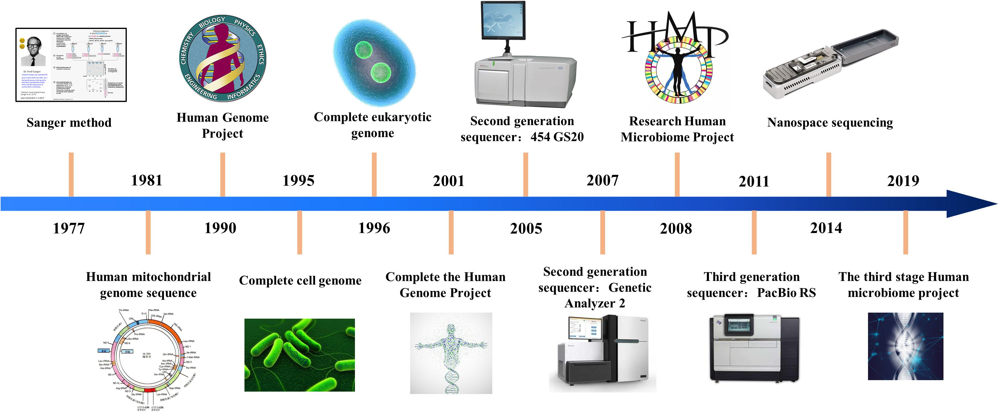
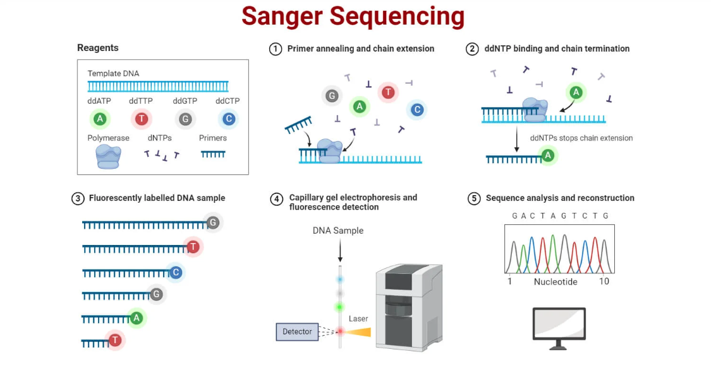

# 1.1. Origen y Definición de la Bioinformática

## 📌 Definición General
La **bioinformática** es una disciplina interdisciplinaria que combina **biología, informática, matemáticas y estadística** con el fin de **almacenar, analizar e interpretar datos biológicos**.
Su objetivo central es **transformar datos biológicos en conocimiento útil**, permitiendo descubrir patrones, relaciones y mecanismos que no serían evidentes sin la ayuda de herramientas computacionales.

**Repaso**
Dogma central de DNA ¿quién se acuerda?

[figura3.jpeg](figura3jpeg)

¿y de la PCR?...

---

## 📌 Contexto Histórico del Origen

### 🔹 Antes de la era genómica (años 60–80)
- En los **años 60 y 70**, los biólogos comenzaron a acumular secuencias de proteínas y ácidos nucleicos.
- Una de las primeras bases de datos fue creada por **Margaret Dayhoff** en 1965, llamada **Atlas of Protein Sequence and Structure**, que recopilaba secuencias de proteínas conocidas.
- Se desarrollaron los primeros algoritmos para comparar secuencias, como el **algoritmo de Needleman-Wunsch (1970)** para alineamientos globales.
- Durante esta etapa, los datos eran aún manejables de forma manual o con programas muy básicos.
  

---

### 🔹 El impacto del Proyecto Genoma Humano (1990–2003)
- El **Proyecto Genoma Humano (PGH)** fue un hito que cambió radicalmente la biología.
- Se inició en **1990**, con el objetivo de secuenciar los ~3,000 millones de pares de bases del genoma humano.
- Para el año **2000**, ya se habían secuenciado grandes porciones del genoma, y en **2003** se anunció la versión final.
- Este proyecto generó una **enorme cantidad de datos biológicos sin precedentes**, imposibles de analizar únicamente con métodos tradicionales de biología de laboratorio.

👉 Fue en este contexto donde la **bioinformática se consolidó como disciplina**:
- Se necesitaban **bases de datos capaces de almacenar millones de secuencias**.
- Surgieron **algoritmos y software especializados** para búsqueda, ensamblaje y comparación de secuencias.
- Se establecieron centros de información biológica como el **NCBI (National Center for Biotechnology Information)** en EE. UU., el **EMBL-EBI** en Europa y el **DDBJ** en Japón.
- Fundamento de la secuenciación de [Sanger](https://genotipia.com/sanger/)
  

---

### 🔹 Era de la secuenciación masiva (NGS, desde 2005 en adelante)
- Tras el PGH, la biología entró en la era de la **secuenciación de nueva generación (Next Generation Sequencing, NGS)**.
- Estas tecnologías permitieron **secuenciar genomas completos en días**, generando terabytes de datos.
- Esto expandió la bioinformática más allá de la genómica humana, hacia la **metagenómica, transcriptómica, proteómica y biología de sistemas**.
- Hoy en día, la bioinformática es un pilar en áreas como:
  - **Medicina personalizada** 🧬 (identificación de mutaciones en pacientes).
  - **Agricultura y biotecnología** 🌱 (mejora genética de cultivos y microorganismos).
  - **Ecología** 🌍 (estudio de microbiomas y biodiversidad).

---

## 📌 Definiciones Formales de Bioinformática
- “**Aplicación de técnicas computacionales al manejo y análisis de información biológica**.”
- “**Ciencia de desarrollar algoritmos, bases de datos y herramientas para analizar secuencias de ADN, ARN y proteínas, así como estructuras moleculares y datos ómicos**.”
- En términos prácticos: **bioinformática es el puente entre la biología experimental y la computación**, necesario para manejar el volumen y complejidad de los datos modernos.

---

## 📌 Ejemplo Didáctico para tu curso
- **Antes del PGH**: los científicos podían estudiar un solo gen o proteína de manera individual.
- **Con el PGH**: se necesitó analizar miles de genes de manera simultánea.
- **Hoy**: podemos estudiar **millones de secuencias** en una sola corrida de secuenciación, gracias a la bioinformática.

👉 Sin bioinformática, el conocimiento derivado de proyectos como el **Genoma Humano**, el **Earth Microbiome Project** o el **Proyecto 1000 Genomas** sería prácticamente inalcanzable.

---

## 📌 Conclusión
La **bioinformática surgió como respuesta a la revolución genómica**, especialmente al reto de manejar los datos del **Proyecto Genoma Humano**, y hoy se ha convertido en una disciplina esencial que transforma la biología en una ciencia de datos.  
